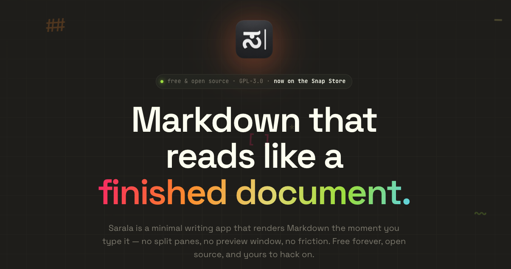
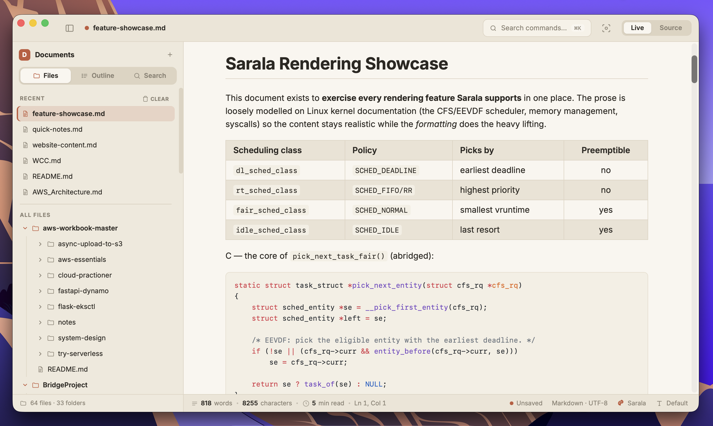
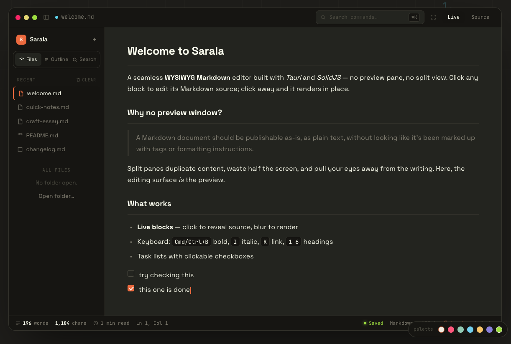

<div align="center">



<h1>Sarala</h1>

**A seamless WYSIWYG Markdown editor — no preview pane, no split view.**

The editing surface *is* the preview. Every paragraph, heading, list, quote, table, and code fence is a live block: click into one and it opens to raw Markdown, click away and it renders in place. One parser, one theme, one window — what you see while writing is exactly what exports.

<br />

[](https://github.com/solancer/sarala/releases/latest)
[](https://github.com/solancer/sarala/actions/workflows/release.yml)
[](https://snapcraft.io/sarala)
[](LICENSE)
[](#run-it)
[](https://tauri.app)
[](https://www.solidjs.com)

</div>

---

## See it

<div align="center">



<sub>*Light theme — rendered tables and Shiki-highlighted code, with the file tree and outline in the sidebar.*</sub>

<br /><br />



<sub>*Night theme — clickable task lists, live-styled inline formatting, and the quick theme palette.*</sub>

</div>

---

## Install

### 🍎 macOS — Homebrew

The easiest way to get Sarala on a Mac:

```bash
brew tap solancer/sarala https://github.com/solancer/sarala
brew install --cask sarala
```

> Sarala's universal build is ad-hoc signed (so it runs natively on both Apple Silicon and Intel) but isn't Apple-notarized. The cask clears the quarantine attribute on install so Gatekeeper won't block the first launch — no extra flags needed. Upgrade later with `brew upgrade --cask sarala`.

### 🐧 Linux — Snap Store

[](https://snapcraft.io/sarala)

```bash
sudo snap install sarala
```

A [Flatpak](flatpak/README.md) package (for Flathub) is in preparation.

### 📦 Every platform — direct download

Grab an installer from the [latest release](https://github.com/solancer/sarala/releases/latest):

| Platform | Files |
| --- | --- |
| **macOS** | `.dmg` (universal) |
| **Windows** | `.exe` · `.msi` |
| **Linux** | `.AppImage` · `.deb` · `.rpm` · [snap](https://snapcraft.io/sarala) |

## Features

- **Live block editing** — type Markdown and the active block styles itself *as you type*: syntax markers stay visible but dimmed (the gray `##` next to a heading, gray `[ ]( )` around a blue link), and the block fully renders when you press **Enter** or move the caret away
- **Smart Enter** — continues lists (with auto-numbering and unchecked task carry-over), continues blockquotes, ends a list on an empty item, auto-closes a just-opened code fence, and inserts plain newlines inside fences; `Shift+Enter` for a soft break
- **Click-to-edit anywhere** — click into rendered text and the caret lands at that exact spot in the source (rendered→source position mapping); merge on backspace at block start, arrow-key navigation across blocks, IME-safe (composition events respected)
- **GFM** — tables, task lists (clickable checkboxes), strikethrough, and fenced code highlighted by [Shiki](https://shiki.style) (TextMate grammars + VS Code themes; light/dark via CSS variables, self-contained inline styles in export)
- **Math** (KaTeX) — inline `$…$` and block `$$…$$`, rendered in inactive blocks and shown as raw source while editing; optional `\(…\)` / `\[…\]` delimiters and a `` ```math `` block (preference-gated, off by default); a broken formula keeps its last good render with an error rather than blanking
- **Diagrams** (Mermaid) — `` ```mermaid `` blocks render every diagram type (flowchart, sequence, gantt, class, state, pie, ER, gitGraph, mindmap, timeline, quadrant, sankey, XY, block, kanban, architecture); invalid syntax shows an inline error and keeps the last good diagram; the diagram theme follows the app's light/dark theme
- **Find & replace** (`Cmd/Ctrl+F`, replace one or all) and an **Open Quickly** fuzzy finder (`Shift+Cmd/Ctrl+P`)
- **Sidebar** — file tree (open a folder, browse `.md` files) and a live outline (click a heading to jump)
- **Distraction-free modes** — **Source mode** (`Cmd/Ctrl+/`) as an escape hatch to the full raw document, plus **Focus** (`F8`) and **Typewriter** (`F9`)
- **Native menu bar** (File, Edit, Paragraph, Format, View, Themes, Window, Help) — every item dispatches through one frontend command bus shared with the keyboard shortcuts
- **Paragraph tools** — heading levels, pipe-table editing (insert/rows/columns/alignment), lists and task toggles, quotes, math/code blocks, `[TOC]`, footnotes, GFM alerts
- **Themes** — Paper, Graphite, GitHub, Night, Newsprint, Whitey — pure CSS variables; add your own in `src/styles/app.css`
- **Export** — HTML (with an outline sidebar), real PDF (headless Chromium with configurable page size, margins, and header/footer using `${pageNo}`/`${totalPages}`/`${title}`/`${date}`; falls back to the print dialog), and docx/odt/rtf/epub/LaTeX/MediaWiki/rst/Textile/OPML via [Pandoc](https://pandoc.org). **Named presets** store a format, output path, after-export action (reveal/open/run a command), and pandoc flags; **Export with Previous** re-runs the last. Per-document YAML keys (`export_filename`, `export_pdf_margin`, …) override settings. Import via Pandoc too
- **Local images** — relative `src` paths resolve against the document's folder (via Tauri's asset protocol) and render inline; inserting an image can copy it into a configurable folder (with a `${filename}` variable), and per-document `copy-images-to` / `image-root-url` YAML keys override the copy folder and image root
- **Built for daily writing** — recent files, settings persisted to disk, smart punctuation, LF/CRLF line endings, word/character count, a dirty indicator (window title shows *— Edited*), confirm-on-close, and **atomic saves** (temp file + rename)
- **Auto-update** (opt-in) — **Help ▸ Check for Updates…** checks a manifest, then downloads, verifies (minisign), installs, and relaunches — signed artifacts from GitHub Releases, see [Releasing](#releasing)

## Shortcuts

Most items live in the native menus with their accelerators shown inline; the core set:

| Keys | Action |
| --- | --- |
| `Cmd/Ctrl+S` / `Shift+Cmd/Ctrl+S` | Save / Save As |
| `Cmd/Ctrl+O` / `Shift+Cmd/Ctrl+O` | Open file / Open folder |
| `Shift+Cmd/Ctrl+P` | Open Quickly |
| `Cmd/Ctrl+F` / `Cmd/Ctrl+G` / `Alt+Cmd/Ctrl+F` | Find / Find next / Replace |
| `Cmd/Ctrl+/` | Toggle source mode |
| `Shift+Cmd/Ctrl+L` | Toggle sidebar |
| `F8` / `F9` | Focus mode / Typewriter mode |
| `Cmd/Ctrl+B / I / U / K` | Bold / italic / underline / link |
| `Cmd/Ctrl+E` / `Shift+Cmd/Ctrl+X` | Inline code / strike |
| `Cmd/Ctrl+1…6`, `0` | Heading level / paragraph |
| `Cmd/Ctrl+=` / `Cmd/Ctrl+-` | Increase / decrease heading level |
| `Alt+Cmd/Ctrl+T / C / Q / O / U / X` | Table / fences / quote / ordered / bullet / task list |
| `Alt+Up` / `Alt+Down` | Move block up / down |
| `Shift+Cmd/Ctrl+0 / = / -` | Actual size / zoom in / zoom out |
| `Cmd/Ctrl+P` | Print (also: Export ▸ PDF) |
| `Esc` | Render the current block |

## Run it

Prereqs: Node 18+, Rust stable, and Tauri's platform dependencies
(<https://tauri.app/start/prerequisites/> — on Linux that's `webkit2gtk-4.1`, etc.).

```bash
pnpm install
pnpm tauri dev      # desktop app
pnpm tauri build    # installers in src-tauri/target/release/bundle
```

The frontend also runs standalone in a browser (`pnpm dev`) with an in-memory demo document — file dialogs are desktop-only, and Save downloads the file instead.

## Architecture

```
src/
  markdown.ts        parser config, block splitter (fence/front-matter aware),
                     outline extraction, word count, task toggling
  store.ts           reactive document model: blocks, split/merge, dirty state
  commands.ts        command bus: every menu id / shortcut maps to one action
  settings.ts        persisted settings (recent files, theme, zoom, toggles)
  tabletools.ts      pipe-table parse/serialize + caret-positioned edits
  platform.ts        Tauri invoke bridge with graceful browser fallback
  livesource.ts      the live styler: dims markers, styles content in real
                     time; caret offset get/set; click-position mapping
  components/
    Editor.tsx       block list + click-to-append behavior
    Block.tsx        the hybrid cell: rendered HTML ⇄ live-styled
                     contenteditable source (Enter semantics, caret logic)
    Sidebar.tsx      file tree + outline tabs
    SourceView.tsx   whole-document raw mode
    StatusBar.tsx    counts, theme + mode toggles
    FindBar.tsx      find / replace across blocks
    QuickOpen.tsx    fuzzy file finder overlay
src-tauri/
  src/main.rs        list_dir (md-aware recursive walk), read_file,
                     save_file (atomic write), settings, pandoc bridge,
                     dialog / opener / clipboard plugins
  src/menu.rs        native menu tree; forwards item ids as one "menu"
                     event — no editing logic in Rust
```

**Design notes**

- **Block model over character model.** The document is an array of Markdown blocks (code fences and YAML front matter are kept whole). The active block is a `contenteditable` whose innerHTML is re-styled by `styleSource()` on every input — the key invariant is that the styled HTML's `textContent` is byte-identical to the source, which is what makes caret save/restore by text offset exact (verified by roundtrip tests).
- **One pipeline.** The same `renderMarkdown()` renders editor blocks and the HTML export, so editing view and output can never diverge.
- **Normalization on save** falls out of the model: blocks re-join with exactly one blank line between them.

## Releasing

Releases are automated — bump the version, push a tag, and CI does the rest:

```bash
pnpm release 0.2.0          # bump manifests + commit + tag v0.2.0
pnpm release 0.2.0 --push   # ...and push main + the tag in one go
```

Pushing the `vX.Y.Z` tag triggers [`release.yml`](.github/workflows/release.yml): it builds and signs on macOS (universal), Windows, and Linux; publishes the **GitHub Release** with installers and updater artifacts (each with a `.sig`); and writes `latest.json` to the updater gist — the moment existing installs start seeing the update. The full signing-key setup, CI secrets, `latest.json` shape, and the macOS notarization caveat live in [RELEASING.md](RELEASING.md).

## Roadmap

Custom CSS theme folder.

## License

GPL-3.0-or-later © Srinivas Gowda
