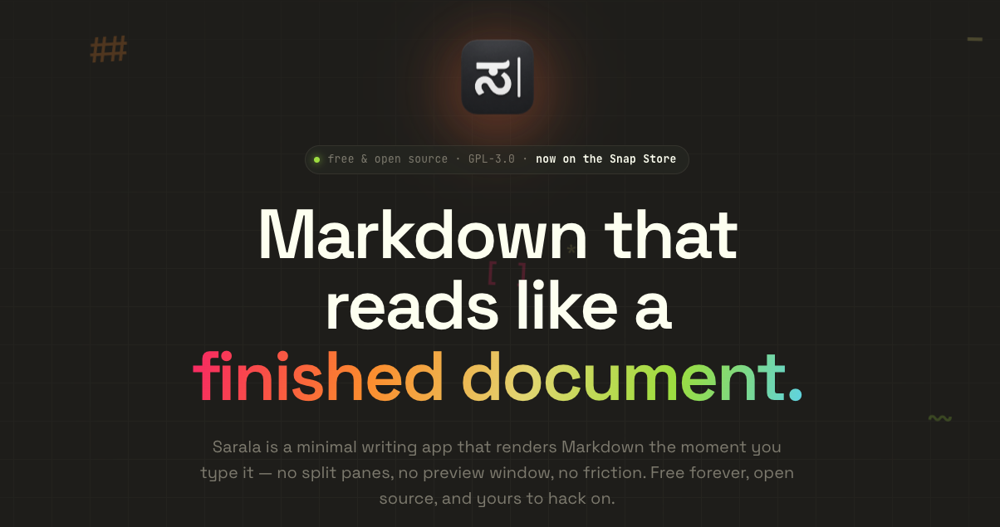
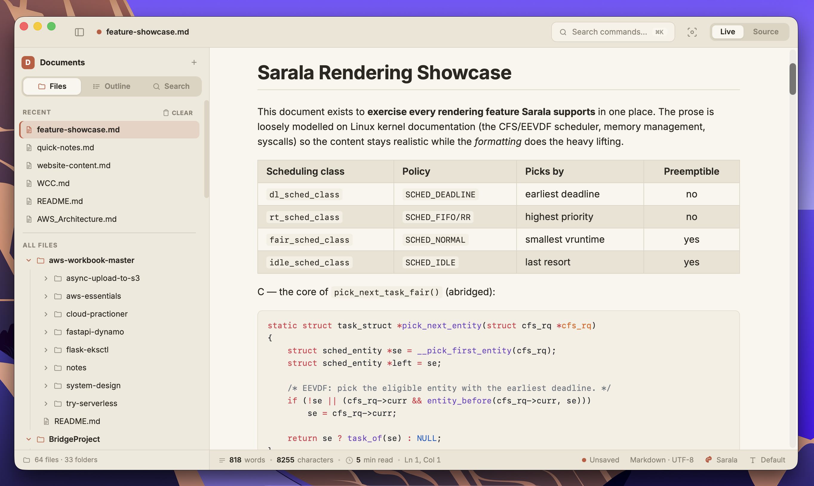
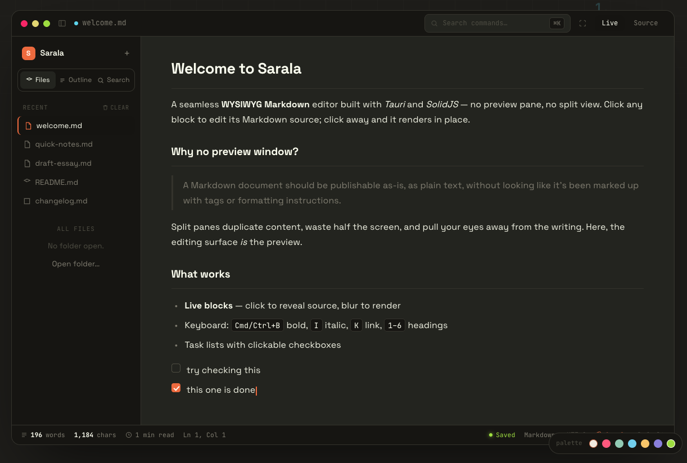

<div align="left">

<h1>Sarala</h1>

**A seamless WYSIWYG Markdown editor. No preview pane, no split view.**

The editing surface *is* the preview. Every paragraph, heading, list, quote, table, and code fence is a live block: click into one and it opens to raw Markdown, click away and it renders in place. One parser, one theme, one window: what you see while writing is exactly what exports.

<br />

[](https://github.com/solancer/sarala/releases/latest)
[](https://github.com/solancer/sarala/actions/workflows/release.yml)
[](https://snapcraft.io/sarala)
[](LICENSE)
[](#build-from-source)
[](https://tauri.app)
[](https://www.solidjs.com)

<br />



</div>

---

## See it

<div align="center">



<sub>*Light theme: rendered tables and Shiki-highlighted code, with the file tree and outline in the sidebar.*</sub>

<br /><br />



<sub>*Night theme: clickable task lists, live-styled inline formatting, and the quick theme palette.*</sub>

</div>

---

## Install

**macOS** via Homebrew:

```bash
brew tap solancer/sarala https://github.com/solancer/sarala
brew trust --cask solancer/sarala/sarala
brew install --cask --yes sarala
```

> `brew trust` is a one-time step: Homebrew 6 refuses to load casks from third-party taps until you trust them (skip it and you get *"Refusing to load cask ... from untrusted tap"*). Older Homebrew has no `trust` command and doesn't need one. Upgrade later with `brew upgrade --cask sarala`.

> The universal build is ad-hoc signed (native on Apple Silicon and Intel) but not Apple-notarized. The cask clears the quarantine attribute on install, so Gatekeeper won't block the first launch.

**Linux** via the [Snap Store](https://snapcraft.io/sarala):

```bash
sudo snap install sarala
```

**Everything else**: grab an installer from the [latest release](https://github.com/solancer/sarala/releases/latest):

| Platform | Files |
| --- | --- |
| **macOS** | `.dmg` (universal) |
| **Windows** | `.exe` · `.msi` |
| **Linux** | `.AppImage` · `.deb` · `.rpm` · [snap](https://snapcraft.io/sarala) |

---

## What you get

**Writing**

- Live blocks: markers stay visible but dimmed while you type, then the block renders when you leave it
- Smart Enter: continues lists and quotes, auto-numbers, closes a just-opened fence; `Shift+Enter` for a soft break
- Click anywhere in rendered text and the caret lands at that exact spot in the source
- Select text for a formatting bar with a block-type dropdown; type `/` for an insert menu
- IME-safe, so CJK composition works as it should

**Content**

- Full GFM: tables, task lists with clickable checkboxes, strikethrough, footnotes, GitHub alerts
- Code fences highlighted by [Shiki](https://shiki.style), with light/dark handled through CSS variables
- Math via KaTeX; diagrams via [Mermaid](https://mermaid.js.org) and [D2](https://d2lang.com). A broken one keeps its last good render instead of blanking
- Tables edit in place; hover an edge to add a row or column
- Images resolve relative to the document, with a properties panel for size, alt, and loading behaviour

**Getting around**

- Document tabs with independent edits and undo history; `Cmd/Ctrl+T` opens a tab, `Cmd/Ctrl+W` closes it, and `Ctrl+Tab` switches tabs

- Sidebar with a file tree, live outline, and full-text search across the folder
- Open Quickly (`Shift+Cmd/Ctrl+P`), find & replace, and a command palette (`Cmd/Ctrl+K`)
- Focus and Typewriter modes, plus Source mode as an escape hatch to the raw document

**Voice typing** (opt-in)

- Speak and Sarala types it. Speech becomes text on your computer: no cloud, no account, no keys. One speech model is downloaded when you turn it on
- Hold the shortcut to talk, or press once to start and again to stop; or let it type at each pause, hands-free
- Text streams into the document as you speak; Return keeps it, Esc discards it (Cmd/Ctrl+Z brings it back)
- One-key control: tap Right Option (Mac) / Right Ctrl to start or stop, hold it to say a command, which is never typed
- Commands for Markdown: "new bullet …", "new heading …", "new task …", "make that bold", "make that a heading", "scratch that"; say "what can I say" for all of them
- Built for people who can't easily type or see the screen: read-back through the screen reader, distinct sounds for every state, spoken punctuation, any shortcut you can reach
- Settings > Voice, or Edit > Voice Typing

**Making it yours**

- 13 built-in themes, plus a **custom theme** built from any [base16](https://github.com/tinted-theming/schemes) scheme: paste one in or edit the sixteen swatches
- Any installed system font for prose and code
- A settings dialog for the rest: Markdown extensions, autosave, line endings, image handling

**Getting it out**

- HTML with an outline sidebar, and real PDF via headless Chromium (page size, margins, header/footer)
- docx, odt, rtf, epub, LaTeX, MediaWiki, rst, Textile, OPML through [Pandoc](https://pandoc.org), with import too
- Named export presets, and per-document YAML keys to override them
- Atomic saves, autosave, crash recovery, and opt-in signed auto-updates

---

## Shortcuts

The menus show every accelerator inline. The ones worth learning:

| Keys | Action |
| --- | --- |
| `Cmd/Ctrl+K` | Command palette |
| `Cmd/Ctrl+S` | Save |
| `Shift+Cmd/Ctrl+P` | Open Quickly |
| `Cmd/Ctrl+F` | Find (`Cmd/Ctrl+G` next, `Alt+Cmd/Ctrl+F` replace) |
| `Cmd/Ctrl+/` | Source mode |
| `Shift+Cmd/Ctrl+L` | Toggle sidebar |
| `F8` / `F9` | Focus / Typewriter mode |
| `Cmd/Ctrl+1…6`, `0` | Heading level / paragraph |
| `Esc` | Render the current block |
| `Cmd+Shift+D` (Mac), `Ctrl+Alt+Space` | Voice typing, once turned on (changeable) |

---

## Build from source

Node 18+, Rust stable, [Tauri's platform prerequisites](https://tauri.app/start/prerequisites/) (on Linux, `webkit2gtk-4.1` and friends), and CMake plus a C++ compiler for voice typing's speech engine (on Linux also `libasound2-dev`). To build without voice typing, pass `--no-default-features` to Cargo.

```bash
pnpm install
pnpm tauri dev      # desktop app
pnpm tauri build    # installers in src-tauri/target/release/bundle
```

`pnpm dev` runs the frontend standalone in a browser, which is handy for UI work, but file dialogs and the file tree are desktop-only.

---

## How it works

Three decisions shape everything else:

**A block model, not a character model.** The document is an array of Markdown blocks (fences and YAML front matter kept whole). The active block is a `contenteditable` whose innerHTML is re-styled on every keystroke, and the load-bearing invariant is that the styled HTML's `textContent` stays *byte-identical* to the Markdown source. That exactness is what lets the caret be saved and restored by plain text offset, and it's covered by roundtrip tests.

**One render pipeline.** The same `renderMarkdown()` draws editor blocks and the HTML export, so what you see and what you ship cannot drift apart.

**Rust holds the filesystem, not the logic.** The backend does directory walks, atomic saves, and the Pandoc bridge; the native menu forwards item ids as events. Every editing decision lives in one frontend command bus shared by the menus, the shortcuts, and the command palette.

---

## Releasing

`pnpm release 0.2.0 --push` bumps the manifests, tags, and pushes; CI builds and signs for all three platforms, publishes the release, and updates the manifest existing installs check. Details in [RELEASING.md](RELEASING.md).

## License

GPL-3.0-or-later © Srinivas Gowda
